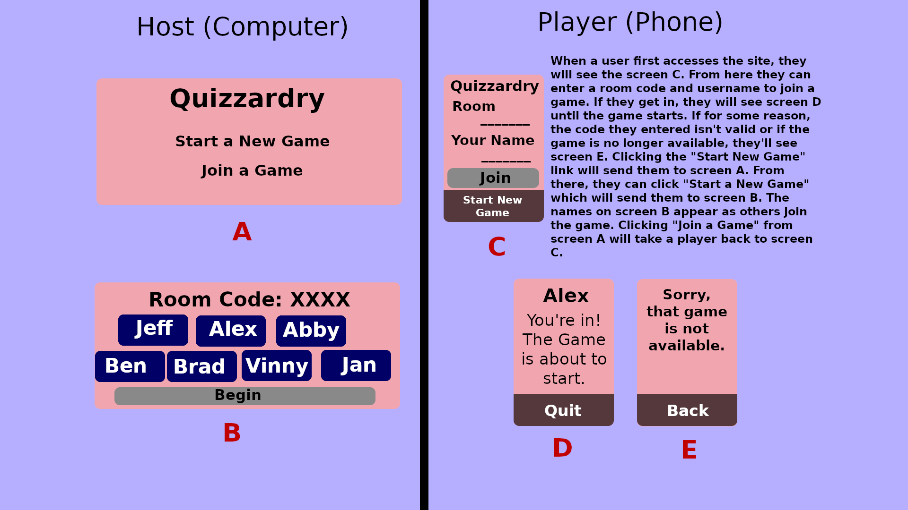
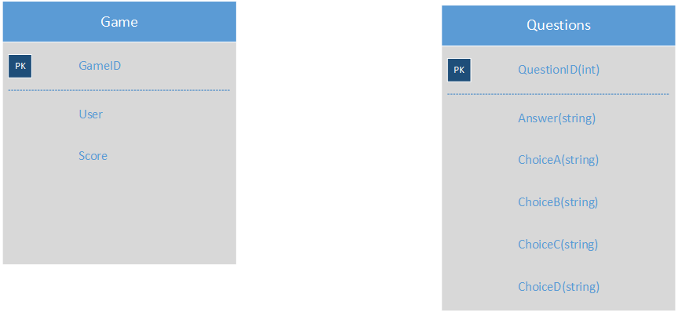
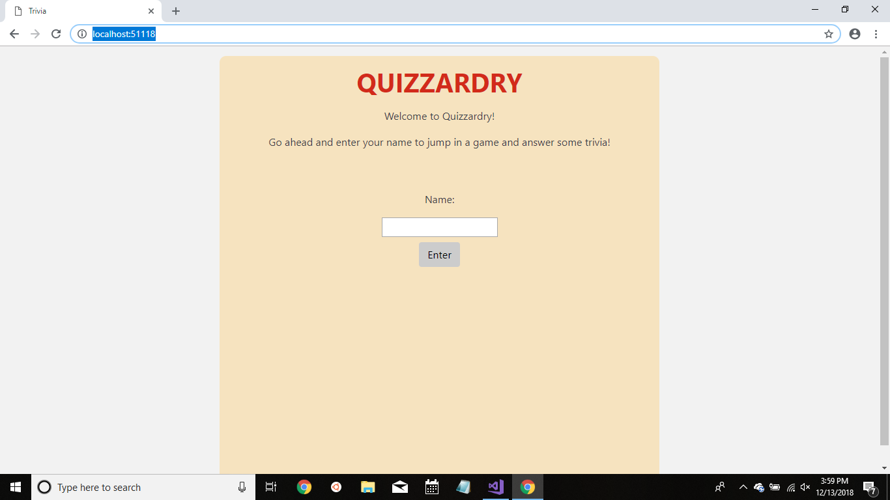
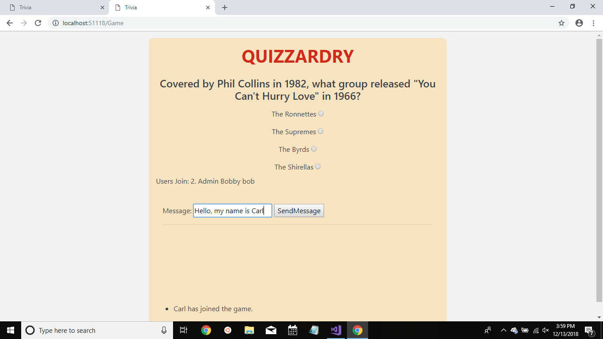
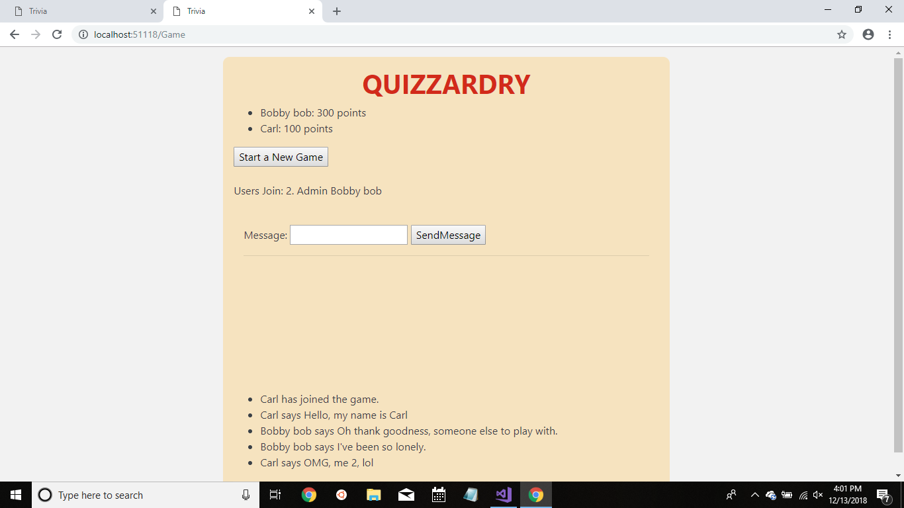

# Quizzardry: The Game

https://quizzardry.azurewebsites.net/

# Introduction

###### Quizzardry is a demonstration of the SignalR library for ASP.NET in the form of a trivia game. The purpose of the application is to allow real-time communication between different clients and a central hub located in the web application. Within a single webpage, the hub will send a single question to all connected users and receive back all of the different answers submitted by the users, which will then be processed for near instantaneous feedback.

###### See [SignalR](http://signalr.net/) for further details.

# Version History

12/13/18 - V1.0

# Contributors

- Vinh Nguyen
- Jimmy Nguyen
- Neth Horn
- Aaron Frank

# Tools

- Microsoft ASP.NET Core MVC with Entity Framework
- Microsoft SQL Server
- Visual Studio 2017
- SignalR
- Git/Github
- Slack
- Bootstrap
- jQuery

# Installation Instructions

- The application can be cloned as is and deployed to the cloud (recommended with Visual Studios 2017). A SQL Database is required and built within Visual Studios IDE. Once deployed, multiple users can join and play the game.

# Site Performance and Vulnerability

- This web application does not ask for or store PII. Session State is used to temporalily store user profile for the duration of the user's browser session. No Data Privacy issue is expected.
- This appliction is not concern with database exposure as the information stored is not sensitive and does not have Insecure Direct Object Exposure.
- This application requires repeated client/server communication actions to occurred. As more users join the game, slowdown is expected, especially when many users connect and disconnect simultaneously.
- Because of the aforementioned reason, this site is susceptible to Bot Exposure and other DDoS attacks. Because of this, a CAPTCHA could be implemented to prevent bots from automatically connecting to the hub. A limit cap of the number of users connected to a hub can also be implemented as welll.
- This appliation does not use Identity, hence user profile and passwords exposure is not a concern.

# Workflow 

## Scope (In/Out)

**In** - This is a game meant to be hosted on one screen but allowing for multiple players to interact with it on their own screens. The most obvious example of this would be to have the game presented on a television screen or computer monitor with players using their phones or other smart-devices to play. This will be a multiple-choice trivia game. The game is called Quizzardry as it will feature a loose wizard theme (perhaps players will get to choose from a number of wizard avatars when they start the game.)

To win the game, the player must have a higher score than all of the other players at the end of a set number of rounds. Every question is worth a number of points. Answering a question correctly will net that player the number of points the question was worth. However, if a player gets a question wrong, they are turned into a toad. Toads CAN NOT win the game.

The final question will see the non-transformed players wagering a number of points not exceeding their current score. The player with the most points after that round wins the game.

**Out** - This will be a web application and will not be ported to any other platforms.

### User Stories

* As a developer, I want to integrate Signal R as the framework for the game to allow real-time simultaneous communications between multiple users and the game.
* As a developer, I want to have a pool of questions and answers to retrieve and display to the users to automatic the trivia game process
* As a developer, I want to have a historical record of winners from each game to present to users.
* As a developer, I want the website to track multiple users in order to calculate the scores of each user.
* As a User, I want to see the winner of the game and the scores as the game progresses.
* As a User, I want the ability to seamlessly join and play the game from different types of platforms.
* As a User, I want to have fun and answer interesting questions.

### MVP

* Players will be able to join the game via their mobile devices.
* Players will be able to answer questions presented on the host screen by choosing one of the four possible answers presented to them on their devices.
* Players can earn points or be eliminated depending on whether or not they answer a question correctly.
* The final round will have the players wagering up to their entire score to win the game.
* The player will earn or lose the amount of points wagered depending on their answer.
* The player with the highest score will win the game.
* There will be enough questions to run one or two demos without repeating questions.

### Stretch

#### Stretch goals (Priority)

* Players with the “transformed” status will not be eliminated right away. And will still be allowed to answer questions and earn points.
* There will be one round near the end of the game in which the playing field will be split up into two teams: toads (players who have missed at least one question) and wizards (players who have not gotten a question wrong up to this point.)
* If a higher percentage of toads answer the question correctly than the percentage of wizards, then all of the wizards will become toads and all of the toads will turn back into wizards.
* After this round, toads will be unable to win.

#### Stretch goals (Excessed)

* Ability to have multiple games hosted simultaneously
* Even more questions (from API)
* Wizard avatars that players can select.

## Functional Requirements

* User can access (join or create) the game
* Users will be able to answer questions for score.
* Users will see scores and questions in real-time.
* Game will tally up final score to display winner.
* Game will end after 6 questions.

## Non-Functional Requirements

* This data transmitted to and from this applicaiton will be secured.
* CRUD operations tested.
* Clean UI for easy user navigatibility 

## Group Work Agreement

### Conflict Plan

When faced with conflict, the team will set time aside at the end of our group standup meetings to discuss the conflict as a group and strive to reach a constructive solution. If the resolution cannot be met, a majority vote is required to proceed forward. If need be, the instructional team acting as a third party will be consulted for guidance on resolving the conflict.

### Communication Plan
- Our team plans to use Slack and Azure DevOps for all communication on project planning and version control.
- Our team plans to approach decision making in a democratic and open manner.
- Morning meetings will be held (in addition to the daily meetings with the instructional team) for discussing completed work, daily work goals, and any conflicts that arise.
- We will also hold end-of-day check-in sessions to ensure we all leave Code Fellows on the same page.
- The team plans to complete all project work during the regular hours of 9:00 am - 6:00 pm and will only do work after hours if absolutely necessary

### Work Plan

- The team will follow initial planning that was agreed upon. The daily standup will set goals for the day and depending on the size of the task and the team members strengths, there will be paired programming or if one person can work on one task, it will be assigned accordingly.  The tasks will be deemed complete once the entire team has reviewed the work and accepted it as complete, otherwise, suggestions for changes will be made. DevOps will be utilized to methodologically ensure tasks are completed.
- Each day the team will have a stand up in the morning to address any concerns and to gauge the progress being made by each team member.  At the end of the day, before the team breaks to go home, a quick meeting will take place. If there appears to be inequality in the amount of work between team members, it will be brought up and addressed here.
- Azure DevOps will be used to keep track of workflow as well as daily meetings to make sure everyone is on task and progress is being made.	

### Git Plan

- After initial scaffolding of the master branch, restrictions will be placed on the master branch to prevent single user merging. DevOps allows the branch to be completely locked.
- Each person will have his/her branch to work on every day. The branch owner is encouraged to do what he/she wants on this branch, including pulling from other user’s branch. This will ensure maximum productivity.
- At the end of the day, everyone will give status reports on the progress of their work and propose updating the master branch with their own branch. The group will evaluate whether features completed by the user merits being incorporated into the product. If the decision is to merge, the user will open the pull request into a staging branch and it will then be reviewed and approved by the group. Once merged, all users will update their own local branch with the updated repository. The group will verify that the staging branch is functional prior to being merged into master.
- Ideally, it would require everyone, not including the author, to review a merge. With a group of 4, this would require 3 people to merge into the master branch. Two is required to merge into the staging branch of the assembled application. This ensures everyone can review the changes and is not caught off guard.
- The last person to give approval during the review process.
- Ideally, the merging process would coincide at the beginning and end of the day status report. This will allow an orderly merging process and allow users to work on their own branch. If a completed feature is needed to be incorporated sometime in the middle of the workday, a special request to merge can be initiated as needed.
- A merge event will always be scheduled every day at a pre-select time (typically at beginning/end-of-day) to coordinate updates into the master branch.
- An ad-hoc review meeting can be initiated by any member in case a specific merge is required.

# Wire Frame

# Database Schema

The main database table will center around the Questions Table. Each entry will have a Question property, 4 answers and the correct answer. This way, each entry can be queried from the database to be displayed on the front end. No relational tables are required for this schema.

The majority of data flow will be stored in memory and will dissipate as the application exits.

The Game Table Schema will not utilized, but may be considered when expanding the application to host several game hubs at once.

# Data Flow

User will visit the web application and create a temp name. First User will initialize a game and a Game Entry will be created in the Database and invite others to join.
Once ready, user will initialize the start of the game, which will signal the host application to retrieve questions from the Questions Table and render to user.
Every user will simultaneously send the answer data to be processed by the host application. Host application will calculate the score
and track it. At the end of the game, the host application will calculate the winner and save the data in the Game Table. 

# Screenshots

